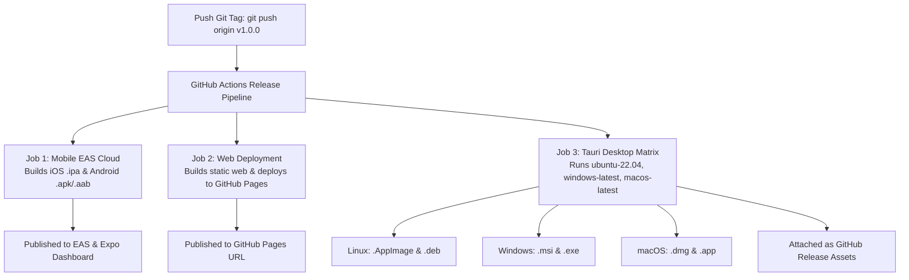

# Falda SuperApp — Architectural Audit & Repository Guide

## Executive Project Summary

**Falda SuperApp** (`falda-superapp`) is a universal cross-platform application engineered to run from a single TypeScript/React Native codebase across **6 target platforms**: **iOS**, **Android**, **Web**, **Windows**, **macOS**, and **Linux**.

### Core Architecture & Design Patterns
- **Mobile Native (iOS & Android):** Powered by **Expo SDK 57 / React Native 0.86 / React 19** utilizing **Continuous Native Generation (CNG)** via Expo Prebuild. Standardized UI components leverage native tab implementations (`expo-router/unstable-native-tabs`) and safe area context.
- **Universal File-Based Routing:** Built with **Expo Router v57**, providing file-system routes in `src/app/` (`/` for home dashboard, `/explore` for discovery, `+not-found.tsx` for unmatched 404 routes).
- **Universal Error Boundaries:** Two-tier error containment with `ErrorBoundaryView` exported from `src/app/_layout.tsx` and route files, isolating screen crashes while keeping navigation alive.
- **Web Platform:** Integrated via **react-native-web** and Expo static export (`expo export -p web`), using custom Web UI navigation (`src/components/app-tabs.web.tsx`) and responsive desktop layout breakpoints.
- **Desktop Platforms (Linux, Windows, macOS):** Encapsulated in `desktop/` using **Tauri v1 / Rust**, wrapping the static export bundle from React Native Web into lightweight, secure native desktop binaries (`.AppImage`/`.deb` on Linux, `.msi`/`.exe` on Windows, `.dmg`/`.app` on macOS) built concurrently via GitHub Actions matrix.
- **Production Web & Container Hosting:** Containerized via multi-stage `Dockerfile` with a zero-dependency static HTTP server (`server.js`) serving the production web export with proper MIME types, caching headers, and SPA/404 fallbacks.

---

## Directory Tree & Module Map

```
falda-superapp/
├── .claude/                  # Claude AI workspace settings & rules
├── .github/                  # GitHub Actions CI/CD workflows
│   └── workflows/
│       ├── release.yml       # 6-platform binary release pipeline
│       └── test.yml          # Automated CI (Jest, Playwright, TSC, Lint)
├── .vscode/                  # Editor workspace settings & recommendations
├── assets/                   # Cross-platform static media assets
│   ├── expo.icon/            # iOS Asset Catalog icon structure
│   └── images/               # High-DPI logos, tab icons, and tutorial graphics
├── desktop/                  # Tauri Rust Desktop Shell project
│   ├── src-tauri/            # Rust source code, build scripts, & Tauri config
│   │   ├── src/main.rs       # Rust main process entrypoint
│   │   ├── Cargo.toml        # Rust dependencies (Tauri 1.5)
│   │   └── tauri.conf.json   # Tauri v1 window, bundle, & web view configuration
│   └── package.json          # Desktop shell NPM scripts (`desktop:dev`, `desktop:build`)
├── e2e/                      # Playwright End-to-End testing suite
│   └── web-linux.spec.ts     # Web & Linux desktop E2E regression tests
├── src/                      # Universal Application Core
│   ├── api/                  # Universal HTTP client abstractions
│   │   ├── __tests__/        # Unit tests for API layer
│   │   ├── client.ts         # Type-safe fetch wrapper with status handling
│   │   └── index.ts          # API module export barrier
│   ├── app/                  # Expo Router file-based route handlers (Single Source of Truth)
│   │   ├── +not-found.tsx    # Universal 404 unmatched route handler
│   │   ├── _layout.tsx       # Root navigation layout, ErrorBoundary & theme provider
│   │   ├── explore.tsx       # Explore / Features screen route
│   │   └── index.tsx         # Unified 6-platform dashboard & interactive demo
│   ├── components/           # UI Component Library
│   │   ├── __tests__/        # Component unit tests (Jest)
│   │   ├── ui/               # Reusable UI primitives (e.g. Collapsible)
│   │   ├── Button.tsx        # Cross-platform accessible Button component
│   │   ├── Sidebar.tsx       # Desktop & Web sidebar component
│   │   ├── Sidebar.windows.tsx # WinUI 3 Fluent Design sidebar override
│   │   ├── animated-icon.tsx # Native Reanimated splash & logo animation with color fallback
│   │   ├── animated-icon.web.tsx # Web CSS module fallback animation
│   │   ├── app-tabs.tsx      # Expo Native Tabs layout component
│   │   ├── app-tabs.web.tsx  # Expo Router UI Web header & tabs bar
│   │   └── error-boundary-view.tsx # Themed cross-platform error recovery UI
│   ├── constants/            # Global constants & theme definitions
│   │   └── theme.ts          # Color palette, spacing scales, & tab insets
│   ├── hooks/                # Custom React Hooks
│   │   ├── use-color-scheme.ts     # Platform color scheme hook (Native)
│   │   ├── use-color-scheme.web.ts # Web color scheme hook fallback
│   │   └── use-theme.ts            # Active theme accessor hook
│   ├── screens/              # Screen re-export barrier
│   │   └── index.ts          # Re-exports unified HomeScreen from src/app/index
│   └── global.css            # Web/Tailwind global style declarations
├── AGENTS.md                 # Agent guidelines & Expo SDK directives
├── App.tsx                   # Standalone RN entrypoint (renders unified src/app/index)
├── Dockerfile                # Multi-stage production static container build
├── LICENSE                   # Software license terms
├── README.md                 # Standard project overview & onboarding
├── app.json                  # Expo SDK & application manifest configuration
├── declarations.d.ts         # TypeScript global module declarations (.css)
├── eas.json                  # Expo Application Services build & update config
├── eslint.config.js          # ESLint 9 configuration
├── package.json              # Main project package manifest & dependencies
├── package-lock.json         # Locked dependency graph
├── playwright.config.ts      # E2E web testing runner configuration
├── server.js                 # Zero-dependency Node.js production static server
└── tsconfig.json             # TypeScript compiler rules & path aliases
```

---

## Target Platform Matrix

| Platform | Rendering Engine / Shell | Route / Entry Point | Platform Overrides |
| :--- | :--- | :--- | :--- |
| **iOS** | Native (UIKit / React Native) | `src/app/_layout.tsx` | Native Bottom Tabs (`app-tabs.tsx`), Reanimated keyframe splash |
| **Android** | Native (Android Views / RN) | `src/app/_layout.tsx` | Predictive back gesture disabled, adaptive icons |
| **Web** | React Native Web + DOM | `src/app/_layout.tsx` | `app-tabs.web.tsx`, `use-color-scheme.web.ts`, CSS module background gradient |
| **Windows** | WinUI 3 Fluent / Tauri Desktop Shell | `desktop/src-tauri` -> `dist` / `App.tsx` | `Sidebar.windows.tsx` (Fluent Design active pill indicator) |
| **macOS** | AppKit / Tauri Desktop Shell | `desktop/src-tauri` -> `dist` / `App.tsx` | Native windowing support and desktop menus |
| **Linux** | Tauri v1 (WebKitGTK / Rust) | `desktop/src-tauri` -> `dist` | Lightweight desktop binary wrapping static web bundle |

---

## Dependency & Config Audit

### Package Summary
- **Core Framework:** `expo` (~57.0.27), `react` (19.2.3), `react-native` (0.86.3), `expo-router` (~57.0.25).
- **Navigation & Native UI:** `react-native-screens` (~4.26.0), `react-native-safe-area-context` (~5.7.0), `react-native-reanimated` (4.5.1), `expo-symbols`, `expo-glass-effect`, `expo-image`, `expo-splash-screen`.
- **Desktop & Web Integration:** `react-native-web` (^0.21.2), `@tauri-apps/cli` (^1.5.0 in `desktop/`), `serve` (^14.2.4).
- **Testing & Tooling:** `jest` (~29.7.0), `jest-expo`, `@testing-library/react-native`, `@playwright/test` (^1.50.0), `typescript` (~6.0.3), `eslint` (^9.0.0).

---

## Local Development & 6-Platform Compilation Guide

### 1. Running the Project in Local Development

| Target / Task | Command | Description |
| :--- | :--- | :--- |
| **Unified Expo CLI** | `npm start` | Launches interactive Metro dev server with QR code and platform shortcuts (`w`, `a`, `i`) |
| **Web Browser** | `npm run web` | Starts web dev server directly on `http://localhost:8081` |
| **Android Device / Emulator** | `npm run android` | Boots Android emulator or connects to an attached USB/Wi-Fi Android device |
| **iOS Simulator (macOS)** | `npm run ios` | Boots iOS Simulator via Xcode |
| **Desktop Shell (Tauri)** | `npm run desktop:dev` | Exports the web bundle and launches the native Tauri desktop development window |
| **Production Web Server Test** | `npm run export:web && npm run start:server` | Compiles static web bundle and boots local production server on `http://localhost:3000` |
| **TypeScript Typecheck** | `npm run typecheck` | Validates strict type checking across all 6 platform targets (`tsc --noEmit`) |
| **Code Linting** | `npm run lint` | Runs ESLint 9 checks across components and routes |
| **Unit & E2E Tests** | `npm test` & `npm run test:e2e` | Executes Jest unit test suites and Playwright headless browser E2E tests |

---

### 2. Compiling All 6 Builds: Is It Automated via GitHub?

**Yes! Compiling and packaging binaries for all 6 target platforms is fully automated** through the GitHub Actions workflow in [`.github/workflows/release.yml`](file:///.github/workflows/release.yml).



#### How It Works:
Whenever you tag a release and push it to GitHub, the workflow triggers automatically:
```bash
git tag v1.0.0
git push origin v1.0.0
```

#### Breakdown of What Gets Built & What Tokens Are Required:

| Build Target | Generated Artifacts | Builder Engine | Required Secret Token | What You Need To Do |
| :--- | :--- | :--- | :--- | :--- |
| **iOS & Android** | `.ipa`, `.apk`, `.aab` | **Expo Application Services (EAS Cloud)** | `EXPO_TOKEN` | 1. Sign up/log in at [expo.dev](https://expo.dev)<br/>2. Go to **Account Settings** -> **Access Tokens** -> Click **Create Token**<br/>3. In your GitHub repo: **Settings** -> **Secrets and variables** -> **Actions** -> **New repository secret**<br/>4. Name: `EXPO_TOKEN`, Value: paste token |
| **Web** | Static PWA bundle | **Expo Export (`expo export -p web`)** | `GITHUB_TOKEN` *(Built-in)* | Automatic! Uses GitHub's built-in token to publish the `./dist` folder to your repo's GitHub Pages |
| **Linux Desktop** | `.AppImage`, `.deb` | **Tauri CLI on `ubuntu-22.04`** | `GITHUB_TOKEN` *(Built-in)* | Automatic! Compiles WebKitGTK Rust desktop wrapper and attaches binaries to GitHub Releases |
| **Windows Desktop**| `.msi`, `.exe` | **Tauri CLI on `windows-latest`** | `GITHUB_TOKEN` *(Built-in)* | Automatic! Compiles native Windows installer via MSVC and attaches to GitHub Releases |
| **macOS Desktop**  | `.dmg`, `.app` | **Tauri CLI on `macos-latest`** | `GITHUB_TOKEN` *(Built-in)* | Automatic! Compiles native Apple binary and attaches to GitHub Releases |

> [!NOTE]
> You only need to provide **one single secret** (`EXPO_TOKEN`) for mobile cloud builds. All 3 desktop platform installers (Linux, Windows, macOS) and the Web deployment use GitHub's standard `GITHUB_TOKEN` with zero extra configuration.

---

## Hosting & Dynamic Web Server Deployment Guide

### 1. Architecture: Dynamic APIs & AI Without Changing the App Wrapper

Falda SuperApp uses [`server.js`](file:///server.js), a zero-dependency Node.js HTTP server configured with:
1. **Dynamic `/api/*` Routing Hook:** Intercepts incoming API calls before static resolution.
2. **Static Asset Streaming:** Serves the client web bundle from `dist/` with MIME detection and SPA fallback.

Because mobile (iOS/Android), desktop (Tauri), and web all communicate via standard HTTP (`fetch`), **adding AI, databases, or API routes directly inside `server.js` requires zero changes to how mobile or desktop wraps the application**:
- Mobile and Desktop apps continue calling your hosted API domain: `https://your-api.domain.com/api/...`
- Web browsers access both the UI and API under the same domain without CORS issues.

#### Example: Adding an AI Endpoint in `server.js`
You can install your preferred AI SDK (e.g. `@google/genai` or `openai`) and handle it inside `server.js`:
```javascript
// Inside server.js within the if (pathname.startsWith('/api/')) block:
if (pathname === '/api/chat' && req.method === 'POST') {
  let body = '';
  req.on('data', chunk => body += chunk);
  req.on('end', async () => {
    const { prompt } = JSON.parse(body);
    // Call Gemini / OpenAI / LLM here:
    const aiResponse = await generateAIResponse(prompt);
    res.writeHead(200, { 'Content-Type': 'application/json' });
    res.end(JSON.stringify({ reply: aiResponse }));
  });
  return;
}
```

---

### 2. Free Dynamic Hosting Options

To run a dynamic server (with custom `/api/` endpoints, background tasks, and AI integrations), you need a platform that hosts dynamic Node.js or Docker containers:

| Hosting Provider | Free Tier Specification | Dynamic API / Node Support | Dockerfile Support | Best Suited For |
| :--- | :--- | :--- | :--- | :--- |
| **[Render](https://render.com)** *(Recommended)* | **Free Web Service**<br/>512 MB RAM, free HTTPS URL (`yourapp.onrender.com`), automatic deploys from GitHub | **Yes** (Native Node.js or Docker runtime) | **Yes** (Uses repository `Dockerfile` directly) | **Best overall** — simplest 1-click GitHub connection, zero build config required |
| **[Fly.io](https://fly.io)** | **Free Allowance**<br/>Up to 3 shared-CPU micro VMs with 256 MB RAM | **Yes** (Runs any containerized process) | **Yes** (`fly launch` automatically detects `Dockerfile`) | Global edge containers with low network latency |
| **[Railway](https://railway.com)** | **Free Trial / Starter Credits**<br/>Fast deployment, persistent volume support | **Yes** (Automatic Node.js runtime) | **Yes** | Best dashboard & built-in database provisioning (Postgres, Redis) |
| **[Koyeb](https://www.koyeb.com)** | **Free Eco Tier**<br/>512 MB RAM micro-instances, automatic SSL | **Yes** (Native Docker engine) | **Yes** | Fast micro-container hosting with global edge network |

---

### 3. Step-by-Step: How to Publish for Free (Render Example)

Render is the most seamless free choice because it supports both Node.js and Docker without credit card requirements.

#### Step 1: Push Your Code to GitHub
Ensure all your latest changes are committed to your GitHub repository:
```bash
git add .
git commit -m "feat: configure dynamic server and release workflows"
git push origin main
```

#### Step 2: Create a New Web Service on Render
1. Visit [dashboard.render.com](https://dashboard.render.com/) and sign up with your GitHub account.
2. In the dashboard, click **New +** -> **Web Service**.
3. Select your `falda-superapp` repository and click **Connect**.

#### Step 3: Configure Deployment Settings
You can choose either of two options:

- **Option A: Docker Deployment (Recommended - Uses project `Dockerfile`):**
  - **Language / Environment:** Select `Docker`.
  - Render automatically detects [`Dockerfile`](file:///Dockerfile), runs the multi-stage build (`expo export -p web`), and starts `server.js` inside an isolated Alpine container.

- **Option B: Native Node.js Deployment:**
  - **Language / Environment:** `Node`.
  - **Build Command:** `npm ci && npm run export:web`
  - **Start Command:** `node server.js`

#### Step 4: Configure Environment Variables
Under the **Environment Variables** section, add:
- `PORT`: `3000` (or leave default, Render injects `PORT` automatically)
- `NODE_ENV`: `production`
- Any AI or database credentials:
  - `GEMINI_API_KEY`: `your_gemini_api_key`
  - `OPENAI_API_KEY`: `your_openai_api_key`

#### Step 5: Deploy & Access
1. Click **Create Web Service**.
2. Render will build your application, export static client assets, and spin up `server.js`.
3. Once the build finishes, you receive a free live HTTPS URL (e.g. `https://falda-superapp.onrender.com`).
4. Test the endpoints:
   - Web App UI: `https://falda-superapp.onrender.com/`
   - Dynamic Health Check API: `https://falda-superapp.onrender.com/api/health`
   - Custom AI Endpoint: `https://falda-superapp.onrender.com/api/chat`


---

## Complete Step-by-Step Deployment Guide

This is the full checklist to go from a local codebase to all 6 platforms running live. Do this once and future releases are a single `git push`.

---

### PHASE 1 — One-Time Account Setup (Do this once, ever)

#### Step 1.1 — Create an Expo Account (for EAS)

**What is EAS?** EAS stands for **Expo Application Services**. It is Expo's cloud build service that compiles your native iOS and Android apps in the cloud — so you don't need Xcode or Android Studio on your machine. Expo's servers do the heavy Rust/Java/Swift compilation for you.

1. Go to **[expo.dev](https://expo.dev)** and click **Sign Up** (free).
2. Verify your email.
3. In the top-right, click your avatar → **Account Settings** → **Access Tokens** tab.
4. Click **Create token**, give it a name like `github-actions-token`.
5. **Copy the token now** — it is only shown once. Keep it somewhere safe.

#### Step 1.2 — Link Your Project to EAS
In the project root on your local machine, run:
```bash
npx eas-cli login            # Log in with your expo.dev credentials
npx eas-cli init             # Links project; sets the projectId in app.json automatically
```
After running `eas init`, your `app.json` will have a new field added:
```json
{
  "expo": {
    "extra": {
      "eas": { "projectId": "xxxxxxxx-xxxx-xxxx-xxxx-xxxxxxxxxxxx" }
    }
  }
}
```
Commit this change:
```bash
git add app.json
git commit -m "chore: link project to EAS"
git push origin main
```

#### Step 1.3 — Create a GitHub Repository
If not already done:
```bash
git remote add origin https://github.com/YOUR_USERNAME/falda-superapp.git
git push -u origin main
```

#### Step 1.4 — Add Secrets to GitHub Repository

Go to your repository on GitHub → **Settings** → **Secrets and variables** → **Actions** → **New repository secret**.

Add the following secrets one by one:

| Secret Name | Value | What It's For |
| :--- | :--- | :--- |
| `EXPO_TOKEN` | Paste the token from Step 1.1 | Authenticates GitHub Actions with EAS to build iOS & Android cloud binaries |

> [!NOTE]
> That's the **only secret you need to add manually**. Everything else (`GITHUB_TOKEN` for Desktop builds and GitHub Pages deploy) is automatically injected by GitHub — you don't configure it.

#### Step 1.5 — Enable GitHub Pages for Web Deployment
Go to your repository → **Settings** → **Pages**:
- Under **Source**, select **Deploy from a branch**.
- Under **Branch**, select `gh-pages`, folder: `/ (root)`.
- Click **Save**.

Your web app will be published at: `https://YOUR_USERNAME.github.io/falda-superapp` after the first release tag push.

---

### PHASE 2 — One-Time Local Environment Setup

#### Step 2.1 — Create Your `.env` File
Create `.env` in the project root (already gitignored — safe, never committed):
```bash
# Backend API base URL for native apps (Expo Go, installed .apk/.ipa)
EXPO_PUBLIC_API_URL=https://falda-superapp.onrender.com

# Add AI or database credentials here:
GEMINI_API_KEY=your_gemini_api_key_here
OPENAI_API_KEY=your_openai_api_key_here
```

> [!IMPORTANT]
> `EXPO_PUBLIC_` prefix is **required** for Expo to embed the variable into the native bundle. Variables without this prefix stay server-side only in `server.js`.

#### Step 2.2 — Deploy the Web Server to Render (Your Backend Host)

1. Sign up at **[render.com](https://render.com)** using GitHub (free, no credit card).
2. Dashboard → **New +** → **Web Service** → Select your `falda-superapp` repository.
3. Configure:
   - **Name:** `falda-superapp` (becomes `falda-superapp.onrender.com`)
   - **Environment:** `Docker` *(Render auto-detects your `Dockerfile`)*
   - **Instance Type:** `Free`
4. Under **Environment Variables**, add:
   ```
   NODE_ENV = production
   GEMINI_API_KEY = your_gemini_api_key_here
   OPENAI_API_KEY = your_openai_api_key_here
   ```
   *(Do NOT add PORT — Render injects it automatically)*
5. Click **Create Web Service**. Render builds and deploys.
6. Your live URL is now: `https://falda-superapp.onrender.com`
7. **Update your local `.env` file** `EXPO_PUBLIC_API_URL` to match this URL.

---

### PHASE 3 — Publishing a Release (Every Time You Ship)

This is the workflow you run every time you want to release a new version:

#### Step 3.1 — Commit & Push All Your Changes
```bash
git add .
git commit -m "feat: your feature description"
git push origin main
```
This triggers the **CI test suite** automatically (Jest + Playwright + TypeScript + Lint).

#### Step 3.2 — Tag the Release
```bash
git tag v1.0.0       # Use semantic versioning: v1.0.0, v1.1.0, v1.0.1, etc.
git push origin v1.0.0
```

**Pushing this tag automatically triggers the full release pipeline in `.github/workflows/release.yml`:**

```
Tag pushed → GitHub Actions runs 3 parallel jobs:
├── Job 1: EAS Cloud Builds (uses EXPO_TOKEN secret)
│   ├── iOS .ipa  ──→ Uploaded to expo.dev dashboard
│   └── Android .apk/.aab ──→ Uploaded to expo.dev dashboard
│
├── Job 2: Web Deployment (uses built-in GITHUB_TOKEN)
│   └── Static web bundle ──→ Deployed to GitHub Pages
│        https://YOUR_USERNAME.github.io/falda-superapp
│
└── Job 3: Desktop Matrix (uses built-in GITHUB_TOKEN)
    ├── ubuntu-22.04 ──→ Linux .AppImage + .deb
    ├── windows-latest ──→ Windows .msi + .exe
    └── macos-latest ──→ macOS .dmg + .app
         All attached as downloadable assets to GitHub Release page
```

#### Step 3.3 — Monitor the Pipeline
- Go to your GitHub repository → **Actions** tab.
- Click the running workflow to watch each job's progress in real time.
- Estimated build times: Web & Desktop ~5–10 min, EAS Mobile ~15–25 min.

#### Step 3.4 — Access Your Deployments After Build Completes

| Platform | Where to Get It | How User Installs / Accesses |
| :--- | :--- | :--- |
| **Web App** | `https://YOUR_USERNAME.github.io/falda-superapp` | Open in any browser, Add to Home Screen as PWA |
| **Web Server + APIs** | `https://falda-superapp.onrender.com` | Serve backend API endpoints to all clients |
| **Android APK** | [expo.dev](https://expo.dev) → Your project → Builds | Scan QR in Expo dashboard or download `.apk` |
| **iOS IPA** | [expo.dev](https://expo.dev) → Your project → Builds | TestFlight or direct install (requires Apple Developer account) |
| **Linux Binary** | GitHub → Releases → Your tag → Assets | Download `.AppImage`, `chmod +x`, run it |
| **Windows Installer** | GitHub → Releases → Your tag → Assets | Download `.msi`, double-click to install |
| **macOS App** | GitHub → Releases → Your tag → Assets | Download `.dmg`, open and drag to Applications |

---

### PHASE 4 — OTA Updates (Skip Re-Installing for Mobile)

When you fix a bug or update UI code (without changing native modules), you can push directly to already-installed apps without a new build:

```bash
npx eas-cli update --branch production --message "Fix: button alignment on home screen"
```

Users open their installed app and receive the update silently in the background. **No app store re-approval. No reinstall needed.**

---

### Quick Reference Checklist

```
□ expo.dev account created
□ npx eas-cli login && npx eas-cli init (run locally)
□ app.json committed with projectId
□ GitHub repo created and code pushed
□ GitHub Secrets: EXPO_TOKEN added
□ GitHub Pages enabled (source: gh-pages branch)
□ Render account created and Web Service deployed
□ .env file created locally with EXPO_PUBLIC_API_URL set to Render URL
□ First release: git tag v1.0.0 && git push origin v1.0.0
```
